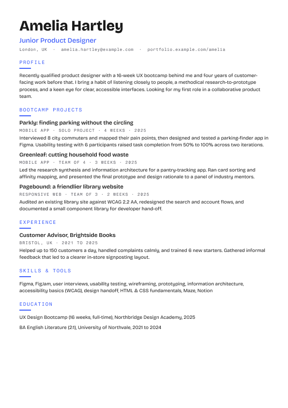
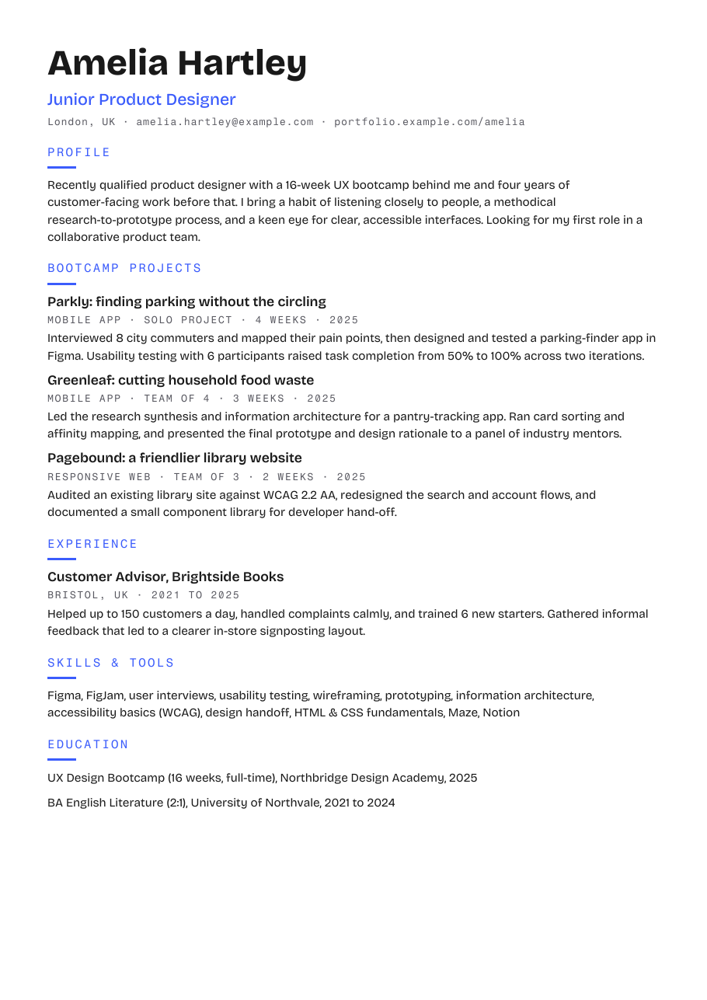
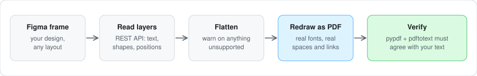
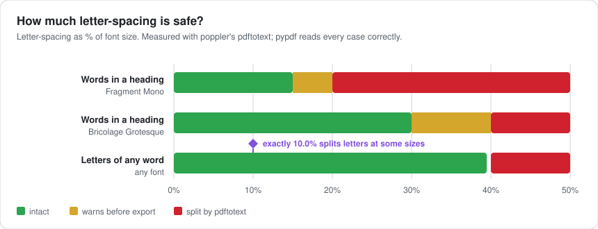

# figma-ats-pdf-exporter

Export a Figma frame to a PDF with **real, embedded, extractable text**.

Figma's native PDF export draws text as vector outlines (`Type3` fonts) and
positions letter-spaced text glyph by glyph. Text extractors, which is what
applicant tracking systems (ATS) and other parsers use, then return garbage:

- `pypdf` returns tracked text split into single characters:
  `B O O T C A M P  P R O J E C T S`
- poppler's `pdftotext` returns the same text one word per line.

This tool rebuilds the page as a new PDF instead. It reads the frame's layout
through the Figma REST API, embeds real TrueType fonts, and uses the PDF
character-spacing operator (`Tc`) for tracked text, so each run stays one
text-showing operation with real word boundaries. It then re-extracts the
text with two independent engines and diffs it against the Figma source.

<p align="center">
  
  &nbsp;&nbsp;
  
</p>
<p align="center"><sub>Left: the frame in Figma. Right: the PDF this tool writes. It looks the same, but every word is real, extractable text.</sub></p>

## How it works



1. Pull the node tree for a frame via the REST API (`figma_client.py`).
2. Flatten it into text runs, rectangles and simple vector icons (`extract.py`).
3. Download Google Fonts files and, for variable fonts, instantiate a static
   `.ttf` at the exact weight used (`fonts.py`, cached in `src/figma_ats_pdf/fonts_cache/`).
4. Draw everything on a `reportlab` canvas at the source's exact coordinates
   (`pdf_builder.py`).
5. Verify the output with `pypdf` and poppler's `pdftotext` (`verify.py`).

## Install

```bash
python3 -m venv .venv
.venv/bin/pip install --upgrade pip
.venv/bin/pip install .
```

For the second verification engine, install poppler (`brew install poppler`
on macOS, `apt install poppler-utils` on Debian/Ubuntu). The tool still runs
without it, with one fewer independent check.

## Usage

You need a Figma personal access token (Figma → Settings → Security →
Personal access tokens, with the `file_content:read` scope), the file key and
the node ID of the frame to export.

- **File key:** the part of the file URL after `/design/`, e.g.
  `https://www.figma.com/design/<FILE_KEY>/My-File`.
- **Node ID:** select the frame and copy its link. `node-id=12-34` in the URL
  means node ID `12:34`.

```bash
export FIGMA_TOKEN=your_personal_access_token
.venv/bin/figma-ats-pdf --file-key <FILE_KEY> --node-id <NODE_ID> -o output/cv.pdf
```

### Try it on the sample

A fictional one-page CV (a made-up junior product designer) exists to demo this tool:

- File key: `Wez5wYYyPKEuBJRrAXP9zR`
- Node ID: `2:2`

```bash
.venv/bin/figma-ats-pdf --file-key Wez5wYYyPKEuBJRrAXP9zR --node-id 2:2 -o output/sample.pdf
```

To avoid hitting the API on every run while you iterate, cache the node JSON:

```bash
.venv/bin/figma-ats-pdf --file-key <FILE_KEY> --node-id <NODE_ID> \
  --cache-node-json output/node_cache.json -o output/cv.pdf
```

Exit codes: `0` clean, `1` the frame can't be exported (the error says why),
`2` the PDF was written but an extractor read it back wrongly.

### Letter-spaced text



Wide letter-spacing can make layout-based extractors (such as poppler's
`pdftotext`) split words or letters. The tool warns before exporting, with the
largest safe value for each layer, and checks the real output afterwards.
If you can't change the design, add `--tighten-word-gaps`:

```bash
.venv/bin/figma-ats-pdf --file-key <FILE_KEY> --node-id <NODE_ID> --tighten-word-gaps -o output/cv.pdf
```

See the [Figma guide](docs/figma-guide.md) for the full list of do's and
don'ts, and what to change when the tool warns.

## Fonts

Only fonts listed in `_FONT_SOURCES` in `fonts.py` get embedded: currently
**Bricolage Grotesque** and **Fragment Mono**, both open-licensed Google
Fonts fetched at runtime from the public `google/fonts` repository. Any other
family falls back to Helvetica, which is still real, extractable text but the
wrong typeface. Add an entry to `_FONT_SOURCES` to support another font.
Font files are not distributed with this repository; you are responsible for
the licenses of any fonts you add.

## Known gaps

- Mixed-style text inside one text node isn't supported; the tool refuses
  with an error rather than restyling the whole layer.
- Only solid fills are drawn. Gradient and image fills, strokes, the line
  tool, per-corner radii, rotation and effects are not supported; each one
  produces a warning.
- Baseline placement uses an approximate ascent ratio rather than real font
  metrics: fine for extractability, imperfect for a pixel-exact match.
- Only two font families are bundled (see Fonts).

## Development

```bash
.venv/bin/pip install -e ".[test]"
.venv/bin/python -m pytest
```

## License

[MIT](LICENSE)
